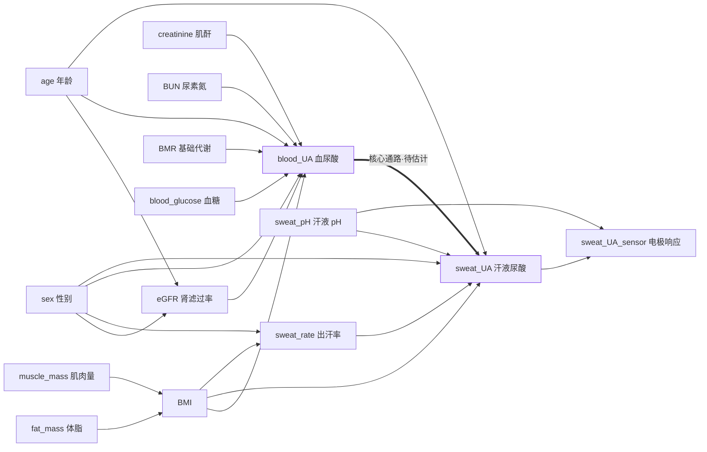

# SweatUric-AI · 汗液尿酸因果机器学习分析管线

**Causal-assumption-guided ML pipeline for non-invasive sweat uric-acid (UA) monitoring.**

能不能**不抽血，只靠一滴汗**就知道血液里的尿酸水平？本仓库用「因果假设优先」的建模范式
（DAG → 后门调整集 → 特征集 → 分组交叉验证）回答这个问题，并让整条分析链路在一台干净机器上
**可一键复现、可机器校验**。

> ## ⚠️ 三条必须先读到的声明
>
> 1. **本仓库内所有数据均为合成数据**（`data/ua_example_merged_data.csv`，由
>    `src/ua_make_example_data.py` 按生理假设生成，`meta.json` 标记 `"synthetic": true`）。
>    仓库里出现的任何 MAE / R² / 置信区间**只用于证明代码能正确运行，不构成任何检测性能证据**。
>    真实受试者数据不存在、也未采集——**伦理审查批件尚未取得**。
> 2. **硬件部分不在本仓库内**。本仓库只覆盖算法与因果建模，不含器件制备工艺、电化学原始曲线、电路图。
>    文中提到的镀铜 LIG 柔性电极与 PCB 采集板是**设计概念**，不是已制造的实物。
> 3. 本仓库为**参赛代码**，为配合材料初评的盲审要求，**不含团队成员姓名、单位、联系方式**。

---

## 1. 第一性原理：汗液→血液的映射为什么难？

如果汗液尿酸和血尿酸是简单的正比关系，测完做个除法就结束了。现实是这条映射被至少四层因素"扭曲"：

1. **浓度鸿沟** —— 尿酸在汗液中的浓度远低于血液，且两者不成正比；
2. **个体差异** —— 皮肤屏障、汗腺密度、体脂率、代谢状态不同，同样的血浓度在不同人汗液里表现不同；
3. **物理稀释** —— 出汗越快汗液越稀，浓度下降是物理现象而非生理变化；
4. **混杂纠缠** —— BMI 高的人血尿酸倾向高、汗液成分也不同。你分不清"汗液尿酸反映了血尿酸"，
   还是"BMI 同时推高了两者"造成的假相关。

**普通机器学习**的做法是把所有变量扔进去让模型自己学。风险在于：如果模型靠"记住这个人是谁"
而不是"学会汗液→血液的映射规律"来拿分，换一批新人就垮了。在 n=50、变量高度共线的场景下，
这几乎是必然结局。

**因果机器学习**的假设不同：变量之间有已知的生成机制，**沿因果结构调整后剩下的关联才是信号**。
先把领域知识固化成一张因果图（谁影响谁），用后门准则推导出*真正需要控制*的最小变量集，
把不该控制的剔掉，再训练模型——相当于给模型加了一道**有生理学依据的先验约束**，
比正则化"均匀压所有系数"更精准。

| 路线 | 做法 | 预期结果 |
|---|---|---|
| 直接相关 | 汗液尿酸对血尿酸直接回归，不管混杂 | 关联弱且不可解释，无法归因 |
| 普通 ML | 全部变量丢给模型 + 正则化 | 训练集好看，跨个体泛化差 |
| **因果 ML（本管线）** | DAG 定结构 → 后门准则挑最小调整集 → 分组评估 | 可解释、可审计、可推广 |

---

## 2. 系统总览：从一滴汗到血尿酸

```text
汗液采集（柔性贴片）    传感器测量           生理协变量
（离子导入刺激出汗） → （镀铜 LIG 电极测    +（出汗率 · BMI · 性别 ·
                       汗液尿酸浓度）        年龄 · 基线 eGFR）
                                ↓
              ① 画因果图（DAG）—— 谁影响谁，每条边给出理由
              ② 后门准则推导 —— 最小充分调整集，该控的控、不该控的剔
              ③ 用因果特征集训练预测模型，按受试者分组评估
                                ↓
              输出：血尿酸估计值   vs   金标准（抽血化验，仅用于验证）
```

关键一点：**血液测量只充当训练/验证标签，绝不作为预测输入**。模型学的是"汗液→血液"的映射，
不是"血液→血液"的同义反复。

## 3. 因果建模：DAG 是管线的「宪法」

DAG（有向无环图）本质是一份**因果假设清单**。15 个节点、22 条边，每条边都附带一句
`rationale`（为什么这么画、生理依据是什么），并被组织成 6 个功能块：



**块一 · 肾功能路径**：血尿酸约 **70% 经肾脏排泄**，肾功能是压倒性的决定因素。
eGFR / creatinine / BUN → blood_UA 构成本场景最核心的混杂来源。

**块二 · 代谢与体成分**：BMI 经胰岛素抵抗同时影响血尿酸与汗液成分，是典型混杂变量；
fat_mass / muscle_mass 对结局的影响全部经 BMI 中介。

**块三 · 人口学**：sex、age 同时指向汗液与血尿酸，开后门路径，必须调整。

**块四 · 汗液动力学与化学**：出汗率越高汗液越稀；尿酸是弱酸（pKa₁ ≈ 5.4），
汗液 pH（4.5–7.0）直接改变离子化比例与电极响应增益。

**块五 · 核心因果通路**：`blood_UA → sweat_UA` 是 22 条边里唯一效应大小未知的边——
整个分析的目的就是估计它。把 blood_UA 放进调整集会阻断效应本身（over-adjustment）。

**块六 · 结构完整性补丁**：给 sweat_rate 补父节点（否则无法对其做后门调整）、
给电极响应补测量边（否则部署模式下因果推理没有根基）。

### 3.1 变量的身份由图结构决定，不由直觉决定

这是本管线最能体现方法论素养的地方。15 个候选变量按图结构逐个判定
（完整推导表见 `results/ua_causal_specification/adjustment_set_derivation.csv`）：

| 变量 | 身份 | 处置 | 为什么 |
|---|---|---|---|
| BMI / sex / age | **混杂变量** | Tier-1 必调 | 同时是处理与结局的父节点，开后门路径 |
| sweat_rate | **联合处理变量** | Tier-1 作为 T2 | 不通向 blood_UA，不是混杂 |
| sweat_pH | **效应修饰变量** | 进交互项 | 只改变"处理→信号"映射增益；误入调整集会引入 M-bias |
| eGFR | **精度变量** | Tier-2 | 只指向结局；取**入组基线值**避免反向因果 |
| creatinine / BUN | 共线 | 剔除 | 信息已被 eGFR 覆盖 |
| fat_mass / muscle_mass | 已阻断 | 剔除 | 路径经 BMI，BMI 已在调整集里 |
| BMR / blood_glucose | 结局侧父节点 | 剔除 | 不指向处理变量，控制只会放大方差 |

两个关键设计决策值得展开：

- **eGFR 为什么是精度变量而非混杂变量？** 图里它只有出边指向 blood_UA、没有指向 sweat_UA 的边，
  按后门准则它不开后门路径。若为了"像混杂"补一条 `blood_UA → eGFR` 就会成环。
  解决办法是给 eGFR 换身份：**入组基线值**，时间上先于研究期内所有血尿酸测量——
  既保持无环，又有生理学依据（反映入组前的累积尿酸负荷）。
- **无环性不是口头承诺**。`validate_dag()` 用 Kahn 拓扑排序强制检测环路，
  任何人改图成环，管线直接报错并列出未解节点（见 `dag_validation.csv`）。

### 3.2 最小调整集 > 全特征模型

- **Tier-1 严格后门最小集（5 列）**：`sweat_UA · sweat_rate · BMI · sex · age`
- **Tier-2（6 列）**：Tier-1 + 基线 eGFR

普通 ML 把 15 个变量全塞进去靠正则化压噪声；本管线的 `Causal_ML` 只有 6 列，
**故意比全特征模型小**——不是"加更多变量"，而是"更精准地选择变量"。

## 4. 五项结构性设计（针对小样本生理数据的常见陷阱）

1. **因果特征集与对照特征集严格分离**。`Causal_ML`（6 列）与 `Ridge`（10 列）特征数不同，
   "因果引导的增益"才能与"多特征带来的增益"分开度量，并由 2×2 消融
   {Ridge, RandomForest} × {全特征, 因果最小集} 进一步拆解。
2. **受试者泄漏防护**。同一人有多条重复测量，按人 `GroupKFold` 而非随机 `KFold`，
   内置泄漏守卫检测到同一受试者跨训练/测试折即报错；另产出 `sensitivity_splitter.csv`
   **量化**随机切分的乐观偏差。
3. **标准化折内完成**。scaler 放进 `Pipeline`，每折独立 fit，测试折统计量不漏进训练。
4. **簇 bootstrap 抗伪重复**。同一个人的 3 次测量高度相关，按受试者整簇重采样，
   p 值用 Fisher z 以**受试者数**（50）而非行数（150）作有效样本量。
5. **合成数据自检防"隐性造假"**。生成器只编码生理假设（CKD-EPI 2021 无种族项 eGFR、
   试剂 LOD 8.0 μmol/L 截尾、汗液 pH 乘性调制），不设定结果目标；
   若合成数据变得"太容易"（相关 > 0.70 或 R² > 0.95）以非 0 退出码报警。

## 5. 目录结构

```text
.
├── run_ua_pipeline.py                  ← 一键跑完整条链路（从这里开始）
├── requirements.txt
├── README.md
├── CITATION.cff
├── docs/
│   ├── UA_MIGRATION_GUIDE.md           ← 场景适配：改了什么、为什么必须改
│   └── (CITATION_VERIFICATION.md 为内部核查记录，不随仓库发布)
├── src/
│   ├── ua_data_utils.py                ← 单一事实源：dtype/编码/切分/泄漏守卫/指标
│   ├── ua_causal_specification.py      ← 「宪法」：22 条边的 DAG、调整集推导、特征集、模型定义
│   ├── ua_run_causal_adjustment.py     ← 调整阶梯 S0–S7：把定性图变成定量曲线
│   ├── ua_reproduce_figure5hi.py       ← 7 模型分组 CV + Bootstrap + 2×2 消融 + 敏感性 + 分层
│   └── ua_make_example_data.py         ← 合成数据生成器（带自检，不是结果生成器）
├── data/
│   ├── ua_merged_data_schema.csv       ← 真实数据采集时的列契约（现在只是契约，没有数据）
│   ├── ua_example_merged_data.csv      ← 合成数据（50 人 × 3 时间点 = 150 行）
│   └── ua_example_merged_data.meta.json← "synthetic": true 标记
└── results/                            ← 已提交的运行产物（28 个文件 + MANIFEST.json）
    ├── ua_causal_specification/         DAG 图与边表、调整集推导、特征集、模型定义
    ├── ua_causal_adjustment/            调整阶梯表 + adjustment_ladder.png
    └── ua_figure5hi/                    主结果、折指标、Bootstrap CI、消融、敏感性、分层
```

`results/` 这里**故意提交**，
原因是技术报告正文直接引用这些图与表；把它们放进仓库，报告里的每个数字都能被点到文件、
并被 `MANIFEST.json` 的 sha256 校验到。重新运行会原地覆盖，不会产生分叉副本。

## 6. 安装与运行

需要 Python ≥ 3.10（本项目在 3.11 上验证）。

```bash
python -m venv .venv
# Windows:  .venv\Scripts\activate      macOS/Linux:  source .venv/bin/activate
python -m pip install -r requirements.txt
python run_ua_pipeline.py --manifest
```

一条命令依次执行 4 个步骤，结束时打印 `管线执行完毕`、逐条列出校验结果，
全部通过则以退出码 0 收尾（任一 FAIL 退出码 3）。常用开关：
`--steps 3,4` 只跑部分步骤，`--skip-smoke` 保留已有数据不重新生成，
`--data` 指定数据文件（接真实数据时用），`--no-verify` 跳过校验，
`--manifest` 写出 `results/MANIFEST.json`，`--marker-mode sensor` 用电极原始响应替代酶法参考值。

分步执行（与上面 4 步一一对应，便于单独调试）：

```bash
python src/ua_make_example_data.py     --out data/ua_example_merged_data.csv
python src/ua_causal_specification.py  --out results/ua_causal_specification
python src/ua_run_causal_adjustment.py --data data/ua_example_merged_data.csv --out results/ua_causal_adjustment
python src/ua_reproduce_figure5hi.py   --data data/ua_example_merged_data.csv --out results/ua_figure5hi
```

也可以只跑其中一步（例如只看 DAG 是否无环）：`python src/ua_causal_specification.py --out results/ua_causal_specification`。

**运行后的机器校验**（`verify_outputs()`，共 24 项）逐条打印 PASS/FAIL，覆盖：
DAG 无环、7 个模型 × 恰好 5 折、50 名受试者在训练/测试折之间零重叠、
`Causal_ML` 特征集与 `Ridge` 特征集互异、`bootstrap_ci.csv` 恰为 14 行（7 模型 × 2 指标）、
肾功能分层表里既有 n≥15 的层也有非空 `skip_reason`、合成数据相关性落在 0.15–0.55 的合理区间。

`--manifest` 额外写出 `results/MANIFEST.json`，为全部产物**以及 5 个 `src/*.py` 源文件**记 sha256——
这样报告引用的每张图和每个数字都能反查到产生它的那份代码；改了代码而忘了重跑，清单就会对不上。

唯一的例外是 `data/ua_example_merged_data.meta.json`：它含 `created_utc` 生成时刻，
每次重跑必然变化。其余 27 条校验值已验证可复现——把本仓库克隆到全新目录后直接
`python run_ua_pipeline.py --manifest`，24 项机检全部通过，产物与仓库中提交的文件逐字节相同。

**可复现性**：随机种子固定为 42，且 `RandomForestRegressor(n_jobs=1)`。
后者不是性能取舍——多线程浮点归约顺序不固定，曾导致同一份代码两次运行输出的
CSV 数值差异在 1e-16 量级却 sha256 不一致，无法做产物校验。改回单线程后
**两次完整运行的产物字节级一致**。

所有文本产物（CSV / JSON / 清单）以 LF 换行写出（pandas 默认用 `os.linesep`，
在 Windows 上会写 CRLF，使同一份代码跨平台产物的 sha256 不同）。
配合 `.gitattributes` 的 `eol=lf`，Git 中的字节、磁盘上的字节与
`MANIFEST.json` 里的 sha256 三者始终一致。

## 7. 因果建模思路（读代码的顺序）

1. **先写图，再写模型。** `ua_causal_specification.py` 里 DAG 是 15 节点 / 22 条边的显式列表，
   每条边带 `rationale`；`validate_dag()` 用 Kahn 拓扑排序强制无环，任何环路直接抛错。
2. **最小充分调整集由图推出，不由 p 值推出。** 后门准则逐路径判定，
   13 个候选变量各自有 `_VERDICT_NOTES` 记录「进/出调整集」的理由（混杂 / 精度变量 / 效应修饰 / 联合处理 / 过度调整）。
3. **eGFR 的处置是本项目的关键分歧点。** 见 3.1 节：入组基线值，Tier-2，不被称为混杂因素。
4. **调整阶梯把定性图变成定量曲线。** `ua_run_causal_adjustment.py` 沿 S0→S7 逐级加入变量，
   每级报告偏相关 r 与**簇稳健**置信区间（有效样本量取**受试者人数**而非行数，避免重复测量伪关联）。
5. **评估协议按受试者分组。** `GroupKFold` 而非 `KFold(shuffle=True)`，
   标准化放在 Pipeline 内做折内 fit，`oof_predict()` 内置泄漏守卫
   （检测到同一受试者同时出现在训练/测试折即报错；唯一例外是
   `kfold_optimism_delta`——它**故意**制造泄漏来量化这种乐观偏差）。

## 8. 当前运行结果（合成数据，只说明代码行为）

`results/` 中的数字来自随机种子 42，重跑可字节级复现。**它们不是性能指标。**

| 观察 | 数值 | 含义 |
|---|---|---|
| 原始汗液–血尿酸关联 | r = 0.516 [0.352, 0.656] | S0 基线 |
| 加入 Tier-1 最小集（BMI, sex, age） | r → 0.329 | 关联**下降**：被控变量在合成机制里确实共享，属正常偏相关行为 |
| 再加 eGFR（Tier-2 精度变量） | r → 0.291 | 同上；这条与早期草稿「加入 eGFR 后关联增强」的说法相反，已在报告中更正 |
| 因果引导特征集 vs 全特征 | ΔR² = +0.062 | 2×2 消融中「特征集」主效应 |
| RandomForest vs Ridge | ΔR² = −0.061 | 小样本线性机制下更强模型并不更优，合理 |
| `Causal_ML` vs `Ridge` | ΔR² = +0.124 [+0.028, +0.251] | CI 不含 0 |
| `Causal_ML` vs 两个阴性对照 | ΔR² = +0.069 / +0.071，CI **含 0** | **因此「因果引导优于随机特征」这一点尚未被证实**，报告按未证实处理 |
| 拆分器敏感性（分组 vs 打乱） | ΔR² = +0.108 [0.020, 0.234] / +0.244 [0.097, 0.483] | 不按受试者分组会显著高估性能 |

两个阴性对照模型（静态 / 动态负对照）是本管线的制度化的"反向验证"：
如果去掉汗液信号后模型性能不掉，说明"增益"只是来自协变量——因果方法就没意义。
当前合成数据下负对照与因果模型差距的 CI 含 0，我们**如实报告为未证实**，
而不是修饰掉——这正是证据分级体系存在的意义。

## 9. 证据分级图例

技术报告与本仓库的产物按同一套标记：

- **【已完成·物证】** 有实物/原始文件可指（本仓库中 = 代码、运行产物、`MANIFEST.json`）。
- **【进行中】** 已在做但未闭合（如真实数据采集方案，等待伦理批件）。
- **【计划】** 设计概念，尚无实物（如镀铜 LIG 电极、PCB 采集板、临床验证）。

## 10. 下一步（与报告第 12 章对应，均为【计划】）

1. 取伦理批件 → 按 `data/ua_merged_data_schema.csv` 的契约采集配对汗液/血尿酸数据；
   代码侧已就绪，真实数据放入 `data/ua_merged_data.csv` 即可复用全部分析（该文件已被 `.gitignore` 禁止入库）。
2. 器件端补齐恒定电位与温度控制，把 `sweat_pH` / `sweat_rate` 从「问卷回忆值」变成同步实测值；
   DAG 中的测量边 `sweat_UA → sweat_UA_sensor` 已为部署模式（用电极原始响应替代酶法金标准）预留接口。
3. 用真实数据重跑全部分析，并按 Bland–Altman 与临床分界点（男性 420 μmol/L）重新定义评价指标——
   届时 `results/` 里的合成数据产物会被替换，报告也将不再引用它们。

---

如果本仓库对你有帮助，请引用本仓库。
